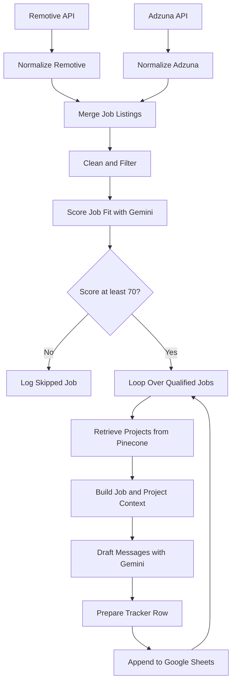
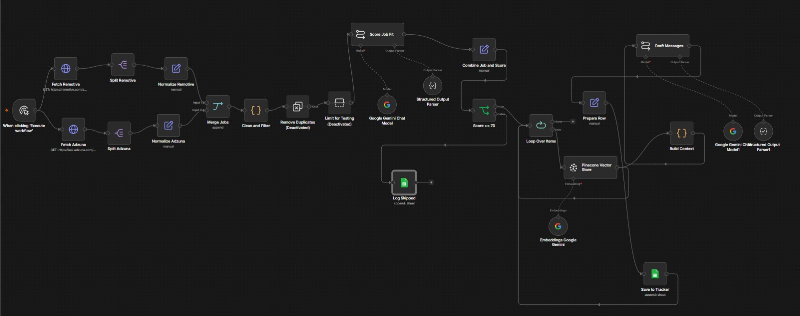
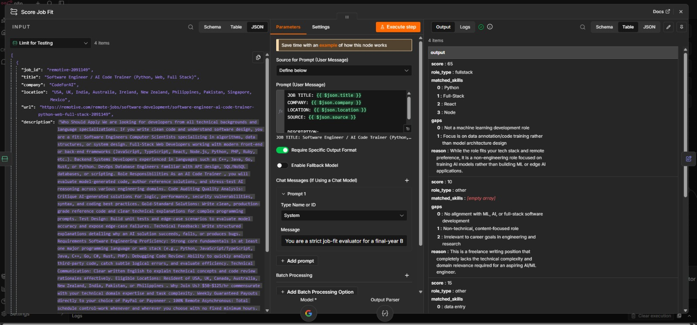
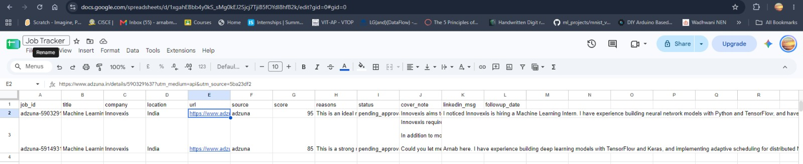
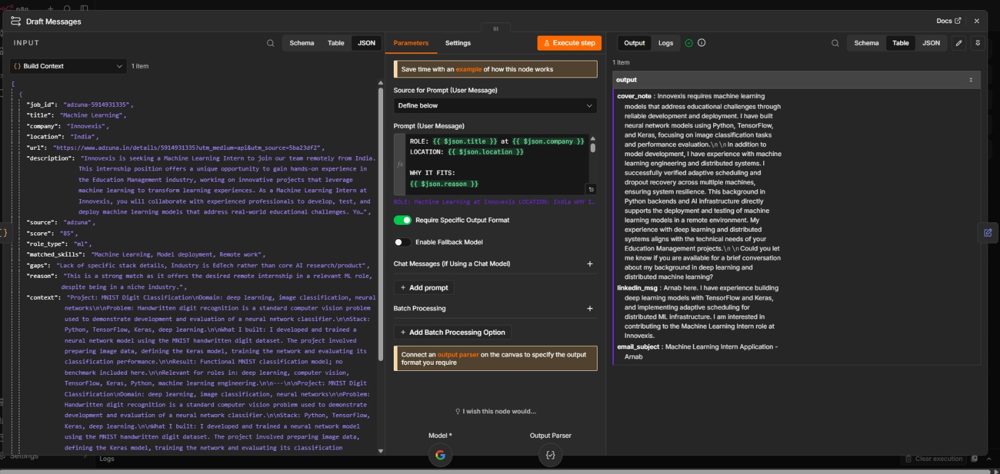

# AI-Powered Job Application Automation Agent

An AI-assisted job-search workflow built with **n8n, Google Gemini, Pinecone, JavaScript, and Google Sheets**. It discovers job listings, normalizes and filters them, evaluates candidate–job fit, retrieves relevant project experience, drafts application messages, and records opportunities for human review.

> **Project status:** Core workflow components have been configured and tested individually. Reliable end-to-end validation, repeated-run behavior, and production-readiness improvements are still in progress.

This project prepares application materials; it **does not automatically submit job applications**.

---

## Table of Contents

- [Overview](#overview)
- [Problem Statement](#problem-statement)
- [Key Features](#key-features)
- [Architecture](#architecture)
- [Workflow](#workflow)
- [Technology Stack](#technology-stack)
- [Job-Fit Scoring](#job-fit-scoring)
- [Project Retrieval](#project-retrieval)
- [Application Drafting](#application-drafting)
- [Google Sheets Tracking](#google-sheets-tracking)
- [Repository Structure](#repository-structure)
- [Prerequisites](#prerequisites)
- [Setup](#setup)
- [Testing and Current Status](#testing-and-current-status)
- [Known Limitations](#known-limitations)
- [Security](#security)
- [Future Improvements](#future-improvements)
- [Learning Outcomes](#learning-outcomes)
- [Disclaimer](#disclaimer)

---

## Overview

Finding internships and entry-level technical roles involves checking multiple job sources, comparing job descriptions with personal skills, identifying relevant projects, and writing a tailored application for each opportunity.

This workflow automates parts of that process. It combines job-source APIs, rule-based processing, LLM-based scoring, vector search over a project knowledge base, message generation, and a Google Sheets tracker.

The workflow is designed as a **human-in-the-loop assistant**: the candidate reviews the job and generated materials before taking any action.

## Problem Statement

Job listings are distributed across different platforms and use different data formats. Manually screening every listing and tailoring messages can take significant time. Generic application messages can also fail to highlight the most relevant candidate experience.

The goal is to build a modular pipeline that reduces this effort while keeping the final application decision under the candidate's control.

## Key Features

- **Multi-source discovery:** Fetch listings from Remotive and Adzuna.
- **Normalization:** Map source-specific responses into a common job schema.
- **Rule-based filtering:** Clean descriptions and exclude selected unsuitable listings.
- **AI job-fit scoring:** Use Google Gemini to estimate relevance and identify skill matches and gaps.
- **Semantic project retrieval:** Search a Pinecone knowledge base for projects related to a job.
- **Personalized drafts:** Generate an application note, a recruiter-facing LinkedIn message, and an email subject.
- **Tracking:** Append qualified opportunities and generated drafts to Google Sheets; log skipped opportunities separately.
- **Human approval:** Save qualified listings with a `pending_approval` status rather than submitting applications automatically.

## Architecture



The diagram shows the intended pipeline. Individual components have been tested, but full end-to-end reliability and recovery behavior still require validation.

## Workflow

The primary n8n workflow is named **`B - Job Pipeline`**.

1. **Fetch jobs:** Request listings from Remotive and Adzuna using configured search parameters.
2. **Split and normalize:** Turn API responses into individual items and map fields into a common schema: `job_id`, `title`, `company`, `location`, `url`, `description`, and `source`.
3. **Clean and filter:** Remove HTML markup, normalize whitespace, limit description length, and apply configurable title, experience, and location rules.
4. **Score job fit:** Ask Gemini to return a score, role category, matched skills, gaps, and a concise explanation.
5. **Route by score:** Jobs meeting the configured threshold (currently 70) proceed. Lower-scoring jobs are logged in the `Skipped` sheet.
6. **Retrieve projects:** Search Pinecone for project information relevant to the job.
7. **Build context:** Combine the job information and retrieved project content.
8. **Draft messages:** Generate the application note, LinkedIn message, and email subject.
9. **Track the opportunity:** Map the result into a consistent row and append it to the `Jobs` sheet with the initial status `pending_approval`.

## Technology Stack

| Technology | Purpose |
|---|---|
| n8n | Workflow orchestration and API integration |
| Google Gemini API | Job-fit scoring and application-message generation |
| Google Gemini Embeddings (`gemini-embedding-001`) | Embeddings for semantic project search |
| Pinecone | Vector storage and project retrieval |
| Google Sheets | Job tracking and review |
| Remotive API | Remote job discovery |
| Adzuna API | Job discovery and search |
| JavaScript | Data cleaning, filtering, and workflow transformations |
| JSON | Exported n8n workflow configurations |

The current Pinecone configuration uses an index named `my-projects`, a namespace named `projects`, and 3072-dimensional vectors. The embedding model and vector dimension must match the index configuration.

## Job-Fit Scoring

Gemini evaluates the available job title, company, location, source, and description against a candidate profile emphasizing machine learning, computer vision, reinforcement learning, edge AI, Python and AI/ML frameworks, full-stack development, and internship or entry-level roles.

| Score | Interpretation |
|---|---|
| 90–100 | Excellent alignment |
| 70–89 | Strong potential match |
| 50–69 | Partial alignment |
| Below 50 | Low alignment |

The workflow currently uses a threshold of **70**. The model also returns a role classification, matched skills, potential gaps, and a short reason.

Scores are decision-support signals, not guarantees of eligibility, interviews, or hiring outcomes. Results depend on the job description, prompt, and model output.

## Project Retrieval

Pinecone stores vector representations of project descriptions. For a job, the workflow searches using the job title and part of its description, then passes retrieved content to the drafting stage.

Example projects represented in the knowledge base include:

- **HALO-FL-Scheduler:** Adaptive federated-learning scheduling, capacity scoring, telemetry, fault tolerance, dropout recovery, and distributed execution across multiple machines.
- **Fire Fighting Rover:** Robotics, autonomous systems, fire detection, sensors, and hardware-oriented development.
- **MNIST Digit Classification:** Image classification, Python, TensorFlow, Keras, and deep-learning fundamentals.

The current retrieval configuration requests up to three records. Retrieval quality affects how specifically the drafts can connect candidate experience to the role. Duplicate chunks and relevance ranking remain areas for improvement.

## Application Drafting

The drafting stage uses the job details, fit explanation, matched skills, job description, and retrieved project context to generate:

- **Application note:** A concise, role-specific draft connecting relevant project experience to the position.
- **LinkedIn message:** A short recruiter outreach message, with a target length under 280 characters.
- **Email subject:** A subject line tailored to the role.

The prompt instructs the model to avoid placeholders, generic language, invented achievements, unsupported technical claims, and irrelevant project references. It also asks for a concrete ask at the end of the application note.

Always review generated messages for accuracy, tone, and suitability before sending them.

## Google Sheets Tracking

The Google Sheets document is named `Job Tracker` and is intended to contain two sheets:

### `Jobs`

Stores qualified opportunities and application drafts, including job ID, title, company, location, URL, source, score, reason, status, application note, and LinkedIn message. The initial status is `pending_approval`.

### `Skipped`

Stores skipped or lower-scoring opportunities with their job details, score, explanation, and `skipped` status.

Check that the spreadsheet columns match the mappings in your imported workflow. The exact fields saved depend on the configured Google Sheets node mappings.

## Repository Structure

The repository is intended to follow this layout:

```text
ai-job-application-agent/
├── README.md
├── .gitignore
├── workflows/
│   ├── job-pipeline.json
│   ├── project-ingestion.json
│   └── test-project-retrieval.json
├── screenshots/
│   ├── workflow-overview.png
│   ├── job-fit-scoring.png
│   ├── job-tracker.png
│   └── project-retrieval-and-drafting.png
└── docs/
    └── architecture.md
```

Only keep entries that actually exist in the repository. If you have not yet created or uploaded a screenshot or `docs/architecture.md`, add it later or remove its entry from this tree until it exists. The workflow JSON files should be stored inside `workflows/`, not at the repository root.

### Screenshots

When the image files have been uploaded, these links will display them in the README:

#### Workflow Overview


#### AI Job-Fit Scoring


#### Job Application Tracker


#### Project Retrieval and Application Drafting


If an image has not yet been uploaded under the exact path and filename above, its preview will not render until you upload it or update the path.

## Prerequisites

To import and configure the workflow, you need:

- An n8n instance with the required HTTP Request, Code, Edit Fields, IF, Loop Over Items, Google Sheets, Gemini, and Pinecone nodes or integrations.
- A Google Gemini API key with suitable permissions and available quota.
- A Pinecone account and a vector index with compatible dimensions.
- Google Sheets access and configured credentials.
- Access to the Remotive and Adzuna APIs.
- A project knowledge base populated with accurate project descriptions.

Model availability, API quotas, provider limits, and network connectivity can affect execution.

## Setup

### 1. Clone the repository

```bash
git clone https://github.com/ArnabTechiee/ai-job-application-agent.git
cd ai-job-application-agent
```

### 2. Import the n8n workflows

1. Open your n8n instance.
2. Import the required JSON export from the `workflows/` directory.
3. Review the nodes, connections, expressions, and settings.
4. Configure credentials inside n8n rather than hard-coding keys into nodes.
5. Verify API parameters and Google Sheets mappings before execution.

### 3. Configure Gemini

Create or select a Google Gemini credential in n8n and choose a model available to your account and supported by the integration. The workflow uses Gemini for scoring and drafting, so quota limits can affect both stages. Check your current API quota before testing the entire pipeline.

### 4. Configure Pinecone

Configure the `my-projects` index and `projects` namespace, with dimensions matching the embedding model. Populate the index with project information and test retrieval before running the full job pipeline.

### 5. Configure Google Sheets

Create or select a spreadsheet named `Job Tracker` with `Jobs` and `Skipped` sheets. Make sure the column headers match the workflow mappings, then connect the Google Sheets credential in n8n.

### 6. Test incrementally

Start with a single job. Verify normalization, filtering, scoring, project retrieval, drafting, and tracker insertion in sequence. Then test multiple jobs, duplicate handling, repeated executions, and failure recovery.

## Testing and Current Status

| Component | Current status |
|---|---|
| Remotive and Adzuna integrations | Configured; network/API reliability should be monitored |
| Job splitting and normalization | Implemented |
| Rule-based filtering | Implemented |
| Gemini job-fit scoring | Tested; dependent on model availability and quota |
| Pinecone project retrieval | Tested individually |
| Project-context assembly | Tested individually |
| Application-message drafting | Tested individually |
| Google Sheets tracking | Configured/tested individually |
| Full end-to-end execution | Needs reliable validation |
| Duplicate handling across repeated runs | Requires final verification |
| Production-grade retry and error handling | Needs improvement |

These status notes reflect the current development state and should be updated as further end-to-end tests pass.

## Known Limitations

1. **API quotas:** Gemini limits can interrupt scoring or message generation.
2. **Job-source noise:** Keyword searches can return unrelated listings or miss relevant roles.
3. **Rule-based filtering:** Simple rules can exclude suitable jobs or retain unsuitable ones.
4. **Retrieval quality:** Duplicate or weakly relevant project chunks can reduce draft quality.
5. **Deduplication:** Repeated runs require reliable deduplication and state management.
6. **LLM variability:** Scores and generated content can vary and may contain errors.
7. **End-to-end reliability:** Multi-item runs, API failures, and recovery behavior need additional testing.
8. **Human review:** The system prepares application materials but does not submit applications automatically.

## Security

- Store API keys and credentials securely in n8n.
- Never publish Gemini keys, Adzuna credentials, access tokens, or private configuration.
- Inspect exported workflow JSON before committing it.
- Do not publish private recruiter conversations or personal application data.
- Redact sensitive information from screenshots and sample records.
- Use least-privilege access for connected services where possible.

A `.gitignore` file helps exclude local secret files, but it **does not remove secrets embedded inside exported workflow JSON**. If a real credential has been committed publicly, revoke or rotate it and review the repository history.

## Future Improvements

- Improve source queries and job relevance filtering.
- Strengthen deduplication across repeated executions.
- Add API-aware retries, backoff, and clearer error logging.
- Reduce unnecessary model calls with pre-filtering and caching.
- Improve Pinecone ranking and remove duplicate project chunks.
- Add configurable role, location, salary, and experience preferences.
- Add application status updates and follow-up reminders.
- Track job-source quality, score distributions, and application progress.
- Add repeatable workflow tests and execution monitoring.
- Validate the full pipeline with reproducible test cases.

## Learning Outcomes

This project provides hands-on experience with:

- n8n workflow orchestration.
- REST API integration and data normalization.
- JavaScript data cleaning and rule-based filtering.
- LLM prompting and structured output.
- Embeddings and vector-based semantic retrieval.
- Retrieval-augmented generation using project context.
- Workflow loops, conditional routing, and failure handling.
- Google Sheets integration and human-in-the-loop automation.
- Secure configuration and responsible AI-assisted job-search workflows.

## Disclaimer

This is a personal automation project for educational and productivity purposes. Verify job availability, eligibility, and application requirements on the original listing. Review and approve generated application materials before use.

**No automatic job application submission is implemented.**
