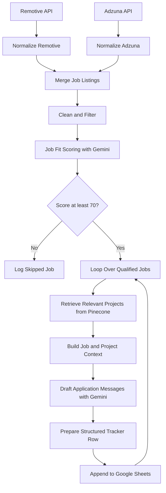

# AI-Powered Job Application Automation Agent

An AI-driven workflow automation system that streamlines job discovery, candidate-job matching, personalized application drafting, and application tracking using **n8n, Google Gemini, Pinecone, and Google Sheets**.

The project demonstrates how large language models, vector search, external APIs, and low-code workflow orchestration can be integrated to build a practical AI agent for job-search assistance.

> **Project status:** Core workflow components implemented; comprehensive end-to-end validation and production-readiness improvements are in progress.

---

## Table of Contents

- [Overview](#overview)
- [Problem Statement](#problem-statement)
- [Project Objectives](#project-objectives)
- [Key Features](#key-features)
- [System Architecture](#system-architecture)
- [Workflow Explanation](#workflow-explanation)
- [Technology Stack](#technology-stack)
- [Job-Fit Scoring](#job-fit-scoring)
- [Semantic Project Retrieval](#semantic-project-retrieval)
- [Personalized Application Drafting](#personalized-application-drafting)
- [Application Tracking](#application-tracking)
- [Project Structure](#project-structure)
- [Prerequisites](#prerequisites)
- [Setup and Configuration](#setup-and-configuration)
- [Security and Privacy](#security-and-privacy)
- [Current Implementation Status](#current-implementation-status)
- [Known Limitations](#known-limitations)
- [Future Enhancements](#future-enhancements)
- [Learning Outcomes](#learning-outcomes)
- [Disclaimer](#disclaimer)

---

## Overview

Searching for internships and entry-level technical positions involves repeatedly visiting job portals, reviewing job descriptions, comparing requirements with existing skills, identifying relevant projects, and writing customized application messages.

This project addresses these challenges through an automated workflow that collects job listings, filters unsuitable opportunities, evaluates job relevance using an LLM, retrieves relevant projects from a vector database, and generates application materials for human review.

The system is designed around a **human-in-the-loop approach**: it assists with job discovery and application preparation while leaving the final decision and submission to the candidate.

### High-Level Capabilities

- Aggregate job listings from multiple sources.
- Standardize job data into a consistent schema.
- Filter selected irrelevant and unsuitable listings.
- Evaluate candidate-job compatibility using Google Gemini.
- Retrieve relevant project information using semantic vector search.
- Generate role-specific application notes and recruiter messages.
- Maintain a centralized Google Sheets job tracker.

---

## Problem Statement

Traditional job searching can be time-consuming because opportunities are distributed across multiple platforms and frequently require manual evaluation.

A generic application message may also fail to communicate the candidate's most relevant technical experience. At the same time, repeatedly searching for projects and tailoring messages for each role creates additional overhead.

The objective of this project is to create a modular automation pipeline that reduces this manual effort through API integration, rule-based processing, LLM-based evaluation, semantic retrieval, and structured tracking.

---

## Project Objectives

1. **Automate job discovery:** Retrieve job listings programmatically from supported job sources.
2. **Normalize job data:** Convert listings from different APIs into a common structure.
3. **Improve job relevance:** Apply configurable rules and AI-based scoring to prioritize opportunities.
4. **Connect jobs with projects:** Retrieve evidence from a personal project knowledge base based on the job requirements.
5. **Personalize application materials:** Generate concise, role-specific drafts grounded in the available candidate information.
6. **Enable review and tracking:** Store shortlisted and rejected opportunities in Google Sheets for subsequent human action.
7. **Maintain modularity:** Keep sourcing, filtering, scoring, retrieval, drafting, and tracking as distinct workflow stages.

---

## Key Features

### 1. Multi-Source Job Discovery

The sourcing stage integrates two job listing APIs:

- **Remotive API:** Retrieves remote job listings based on configured search parameters.
- **Adzuna API:** Retrieves job listings using search terms and filters such as result count and posting age.

Separate branches process the responses from each source before merging them into a common pipeline.

### 2. Job Data Normalization

Listings from different APIs have different field names and response structures. The normalization stage maps them to a common schema containing fields such as:

- `job_id`
- `title`
- `company`
- `location`
- `url`
- `description`
- `source`

Source-specific identifiers are prefixed to help distinguish records originating from different providers.

### 3. Rule-Based Filtering

A JavaScript processing stage cleans job descriptions and applies configurable exclusion rules.

The implemented rules include filtering selected seniority terms, rejecting descriptions that mention certain higher experience requirements, and applying location checks to selected remote listings.

These rules are intended to reduce obviously unsuitable results before the more expensive AI evaluation stage.

### 4. AI-Based Job-Fit Evaluation

Google Gemini evaluates each processed listing against a candidate profile emphasizing:

- Machine Learning
- Computer Vision
- Reinforcement Learning
- Edge AI
- Python and AI/ML frameworks
- Full-stack development skills
- Internship and entry-level opportunities
- Preferred locations and remote or hybrid work

The model produces a numerical score, role classification, matched skills, skill gaps, and a concise explanation.

A configurable threshold separates higher-scoring opportunities from those that are skipped.

### 5. Semantic Project Retrieval

Pinecone stores vector representations of project information. When a job is evaluated, the system uses the job title and a portion of its description to retrieve potentially relevant project records.

This allows application drafts to reference projects according to their relevance instead of relying on a fixed list of projects for every role.

### 6. Personalized Application Drafting

Google Gemini uses the job details, fit explanation, matched skills, job description, and retrieved project context to generate:

- A concise application note
- A recruiter-facing LinkedIn message
- An email subject line

Prompt instructions encourage the model to avoid placeholders, unsupported claims, irrelevant project references, and generic application language.

### 7. Centralized Job Tracking

Google Sheets serves as the review and tracking interface.

Qualified opportunities are saved with their job information, score, reasoning, and generated application materials. The workflow uses a `pending_approval` status to indicate that the candidate should review the opportunity before taking action.

Skipped jobs are recorded separately for auditability and later analysis.

---

## System Architecture



**Architecture note:** The diagram represents the intended workflow design. Successful end-to-end operation, including repeated runs and error recovery, remains subject to further validation.

---

## Workflow Explanation

The primary n8n workflow is named `B - Job Pipeline`.

### Stage 1: Fetch Job Listings

The workflow calls the Remotive and Adzuna APIs using configured query parameters.

Each source returns job data in its own format, so the responses are processed separately before being combined.

### Stage 2: Split and Normalize Results

The workflow splits API responses into individual job items and maps source-specific fields to a common representation.

This makes downstream filtering and evaluation independent of the original API schema.

### Stage 3: Clean and Filter

A JavaScript Code node:

- Removes HTML tags from descriptions.
- Replaces selected HTML entities.
- Normalizes whitespace.
- Limits description length.
- Applies configurable title, experience, and location filters.

The output is a smaller set of normalized job records.

### Stage 4: Score Job Fit

The workflow passes each job's title, company, location, source, and description to Google Gemini.

The structured result includes the score, role type, matched skills, gaps, and reason.

Jobs meeting the configured threshold proceed to the project-retrieval stage. Lower-scoring jobs are logged in the `Skipped` sheet.

### Stage 5: Retrieve Projects

The workflow uses Pinecone vector search to find relevant project records from the `projects` namespace in the `my-projects` index.

The retrieved records provide candidate-specific context for drafting application materials.

### Stage 6: Build Context

A JavaScript Code node combines the current job details with the retrieved project content into a single item.

This creates a consolidated input for the message-generation stage.

### Stage 7: Draft Application Messages

A second Gemini call generates the application note, recruiter message, and email subject using structured output.

The prompt constrains the model to use available evidence rather than inventing project details or achievements.

### Stage 8: Prepare and Save the Tracker Row

An Edit Fields node maps the job data and generated messages into a consistent tracker schema.

The Google Sheets node appends the row to the `Jobs` sheet, using `pending_approval` as the initial status.

The loop then continues to the next qualifying job.

---

## Technology Stack

| Technology | Purpose |
|---|---|
| n8n | Workflow orchestration and API integration |
| Google Gemini API | Job-fit evaluation and message generation |
| Pinecone | Vector storage and semantic project retrieval |
| Google Gemini Embeddings | Generate embeddings for semantic search |
| Google Sheets | Job tracking and review |
| Remotive API | Remote job discovery |
| Adzuna API | Job discovery and search |
| JavaScript | Data transformation, filtering, and workflow logic |
| JSON | Exportable workflow configuration |

### Embedding Configuration

The project knowledge base uses Google's `gemini-embedding-001` embedding model with a 3072-dimensional vector configuration, matching the Pinecone index.

The Pinecone index is named `my-projects`, and the project records are stored in the `projects` namespace.

---

## Job-Fit Scoring

The evaluator uses a 0–100 score to help prioritize opportunities.

| Score range | Interpretation |
|---|---|
| 90–100 | Excellent alignment |
| 70–89 | Strong potential match |
| 50–69 | Partial alignment |
| Below 50 | Low alignment |

The current workflow uses a configurable threshold of **70**.

The score considers technical alignment, career level, job type, available requirements, and relevant location or work-mode preferences. The model also returns matched skills, potential gaps, role classification, and a short reason.

Scores are decision-support signals, not guarantees of interview or hiring success. Their accuracy depends on the quality of job descriptions and model output.

---

## Semantic Project Retrieval

The system uses a personal project knowledge base to connect job requirements with relevant candidate experience.

### Current Project Examples

**HALO-FL-Scheduler**
- Adaptive federated learning scheduling.
- Capacity-based scheduling and telemetry.
- Fault tolerance and dropout recovery.
- Distributed execution across multiple machines.

**Fire Fighting Rover**
- Robotics and autonomous systems.
- Fire detection and firefighting.
- Sensors and hardware-oriented development.

**MNIST Digit Classification**
- Image classification.
- Python, TensorFlow, and Keras.
- Deep learning fundamentals.

The vector search retrieves up to three project records per query in the current configuration. Retrieved context is then supplied to the message-generation model.

The quality of the final drafts depends on retrieval relevance. Duplicate chunks and retrieval ranking are areas for further improvement.

---

## Personalized Application Drafting

The message-generation stage receives the job information and retrieved project context.

It produces three structured fields:

### Application Note

A concise draft connecting relevant candidate experience with the requirements of the specific position.

### LinkedIn Recruiter Message

A short outreach message designed for recruiter communication, with a target length below 280 characters.

### Email Subject

A role-specific subject line for an application email.

### Grounding and Quality Controls

The generation prompt instructs the model to:

- Avoid placeholder text.
- Avoid unsupported technical claims and invented achievements.
- Mention only relevant projects.
- Avoid generic opening phrases.
- Keep messages concise.
- End the application note with a concrete ask.

Generated messages must still be reviewed for factual accuracy, tone, and suitability before being sent.

---

## Application Tracking

The Google Sheets document named `Job Tracker` provides a lightweight interface for reviewing opportunities.

### Jobs Sheet

Stores qualified opportunities and generated application materials, including:

- Job ID and title.
- Company, location, and source.
- Job URL.
- AI fit score and explanation.
- Initial status.
- Application note.
- LinkedIn message.

The intended initial status is `pending_approval`.

### Skipped Sheet

Stores filtered or lower-scoring opportunities with their score, explanation, and `skipped` status.

Separating these records makes it easier to inspect decisions and identify opportunities incorrectly excluded by the workflow.

---

## Project Structure

The repository is organized to separate workflow exports, documentation, and visual evidence.

```text
ai-job-application-agent/
├── README.md
├── .gitignore
├── workflows/
│   ├── job-pipeline.json
│   ├── test-project-retrieval.json
│   └── project-ingestion.json
├── screenshots/
│   ├── workflow-overview.png
│   ├── job-tracker.png
│   └── project-retrieval.png
└── docs/
    └── architecture.md
```

The filenames above are examples. Keep only files that actually exist in the repository and ensure all exported workflow files are sanitized before publication.

---

## Prerequisites

To import and run the workflows, you need:

- An n8n instance with access to HTTP Request, Code, Edit Fields, IF, Loop Over Items, Google Sheets, and the required AI/Pinecone integrations.
- A Google Gemini API key with suitable quota and permissions.
- A Pinecone account and a compatible vector index.
- Google Sheets access and configured credentials.
- Access to the Remotive and Adzuna APIs.
- A project knowledge base populated with relevant project information.

API availability, model availability, quotas, and account limits may affect execution.

---

## Setup and Configuration

### 1. Clone the repository

```bash
git clone https://github.com/YOUR_USERNAME/ai-job-application-agent.git
cd ai-job-application-agent
```

Replace `YOUR_USERNAME` with your GitHub username.

### 2. Import the n8n workflows

1. Open your n8n instance.
2. Import the appropriate JSON file from the `workflows/` directory.
3. Review the imported nodes and connections.
4. Configure the required credentials within n8n.
5. Verify API parameters and spreadsheet mappings before execution.

### 3. Configure Google Gemini

Configure a Gemini API credential in n8n and select a model supported by your account and the integration.

Check current quota and billing limits before testing the complete workflow. The pipeline uses Gemini for both job-fit scoring and application drafting.

### 4. Configure Pinecone

Create or select a compatible index with the expected vector dimension.

Configure the `my-projects` index and `projects` namespace, and ensure the corresponding embedding model matches the index dimensions.

Populate the knowledge base with meaningful project descriptions and verify retrieval before running the main pipeline.

### 5. Configure Google Sheets

Create or configure the `Job Tracker` spreadsheet with the required `Jobs` and `Skipped` sheets.

Verify that column names match the workflow mappings. Configure the Google Sheets credential within n8n.

### 6. Test incrementally

Run the workflow with a single job first. Confirm that job normalization, filtering, scoring, retrieval, drafting, and tracker insertion work as expected.

After individual stages pass, test multiple items, duplicate handling, repeated executions, and failure recovery.

---

## Security and Privacy

This project integrates external APIs and personal application information, so credential handling is important.

- Store API keys and credentials securely in n8n.
- Never publish Gemini or Adzuna credentials, access tokens, or private configuration.
- Inspect exported workflow JSON before committing it.
- Do not publish private recruiter conversations or personal application data.
- Use sanitized screenshots and sample records in public documentation.
- Apply least-privilege access to connected services wherever possible.

A `.gitignore` file helps exclude local secret files, but it does not automatically remove credentials embedded in workflow exports.

---

## Current Implementation Status

| Component | Status |
|---|---|
| Remotive and Adzuna integration | Configured |
| Job splitting and normalization | Implemented |
| Rule-based filtering | Implemented |
| Gemini job-fit scoring | Configured; quota-dependent |
| Pinecone project retrieval | Tested individually |
| Project context assembly | Tested individually |
| Application message drafting | Tested individually |
| Google Sheets tracking | Tested individually |
| Full end-to-end execution | Pending reliable validation |
| Duplicate handling across repeated runs | Requires final verification |
| Production-grade retry and error handling | Requires improvement |

The system has been assembled and its major components have been tested individually. Full end-to-end reliability has not yet been established, and Gemini free-tier quota exhaustion has interrupted further testing.

---

## Known Limitations

1. **API quota constraints:** Gemini request limits can interrupt scoring and message generation.
2. **Job-source noise:** Keyword-based searches may return unrelated roles.
3. **Rule-based filtering:** Simple keyword rules can incorrectly exclude suitable jobs or allow irrelevant listings through.
4. **Retrieval quality:** Duplicate or weakly relevant project chunks can reduce the quality of generated messages.
5. **Duplicate prevention:** Repeated executions require reliable deduplication and state management.
6. **LLM variability:** Scores and generated messages may vary and should not be treated as authoritative decisions.
7. **End-to-end reliability:** Multi-job execution, recovery from API failures, and repeated-run behavior need additional testing.
8. **Human review:** The system prepares application materials but does not automatically submit applications.

---

## Future Enhancements

- Improve job-source queries and relevance filtering.
- Add stronger job deduplication across repeated runs.
- Introduce API-aware retry logic, backoff, and error logging.
- Reduce unnecessary LLM calls through pre-filtering and caching.
- Improve Pinecone retrieval quality and remove duplicate project chunks.
- Add configurable role, location, salary, and experience preferences.
- Add application-status updates and follow-up reminders.
- Build analytics for job sources, score distributions, and application progress.
- Add automated workflow tests and execution monitoring.
- Validate the entire workflow using repeatable test cases.

---

## Learning Outcomes

This project provides practical experience with:

- AI workflow orchestration using n8n.
- REST API integration and data normalization.
- Rule-based filtering and structured JavaScript transformations.
- LLM prompting and structured outputs.
- Embeddings and vector-based semantic retrieval.
- Retrieval-augmented generation using personal project context.
- Workflow loops, conditional routing, and error handling.
- Google Sheets integration and human-in-the-loop automation.
- Secure configuration and responsible AI-assisted application preparation.

---

## Disclaimer

This is a personal automation project intended for educational and productivity purposes. Job availability, eligibility, and application requirements should be verified at the original source. Generated application materials should be reviewed and approved by the candidate before use.

**No automatic job application submission is implemented.**